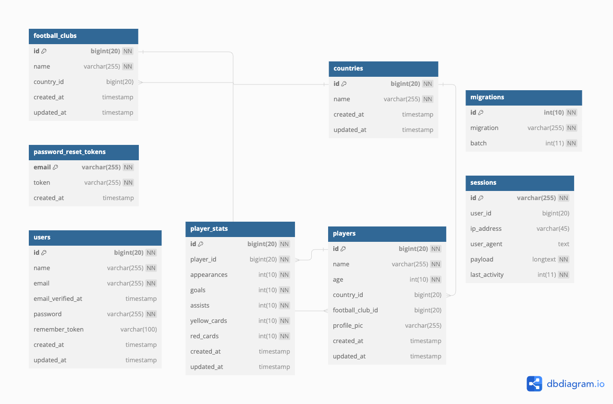
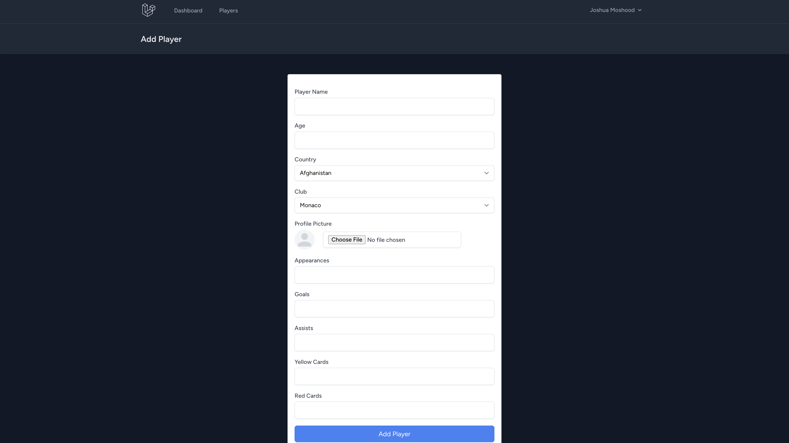
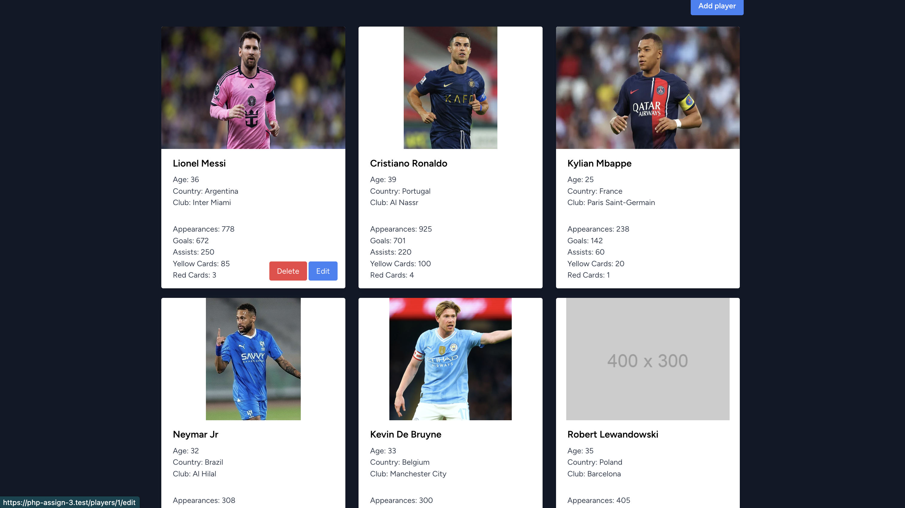
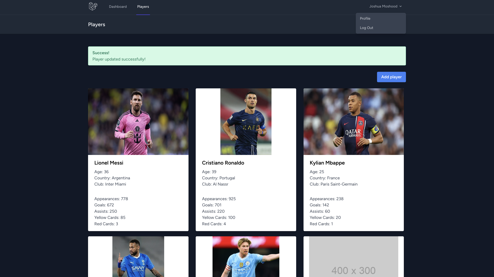
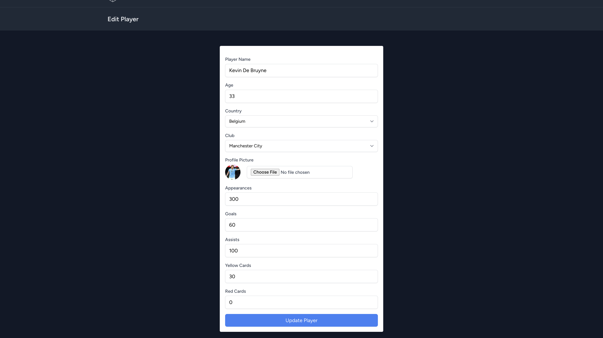

# Football Players Wiki
Football Players Wiki is a CRUD with laravel framework. It holds players details and theirs stats.

### Database Schema

### Features
- CRUD functionality to manage players & player's stats
- Authentication
- dashboard
- validation

### Screenshots

#### Thoughts on Laravel 
One of my fave backend frameworks, i love developer experience and official doc

